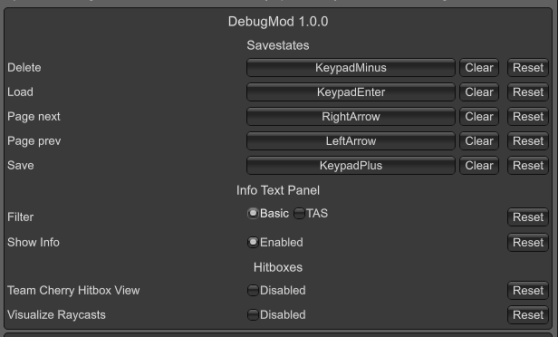

# DubiDebugMod

Download is [here](https://github.com/jakobhellermann/Silksong-DubiDebugMod/releases).

## Features

### Savestates

Press `NumpadPlus` `3` to create a savestate in slot 3, then `NumpadEnter` `3` to load that savestates. You can navigate through the savestate pages with the arrow keys.

You can find the savestate files in `Game Directory/ModData/DebugMod/Savestate/main/slot-name.json`. You can change the name manually if you want.

### Configuration

The mod uses the native configuration options of BepInEx.
You can use [BepInEx/ConfigurationManager](https://github.com/BepInEx/BepInEx.ConfigurationManager) to change options at runtime (default shortcut is F1) or edit them in the config files.

